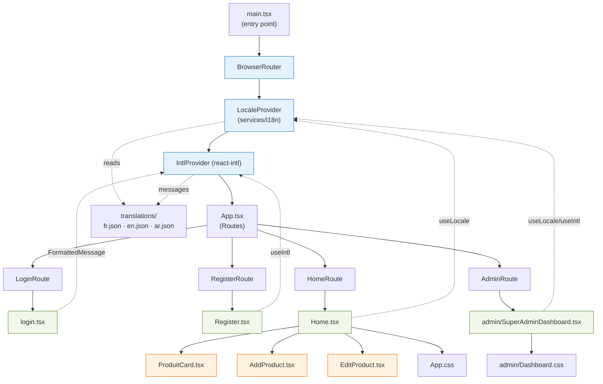
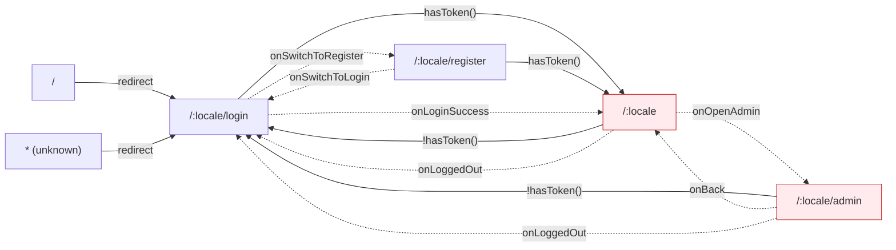
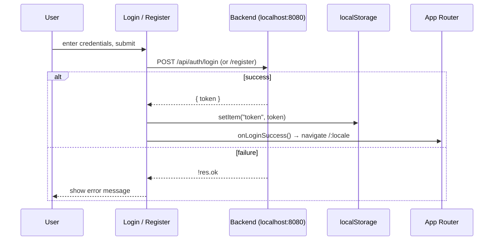
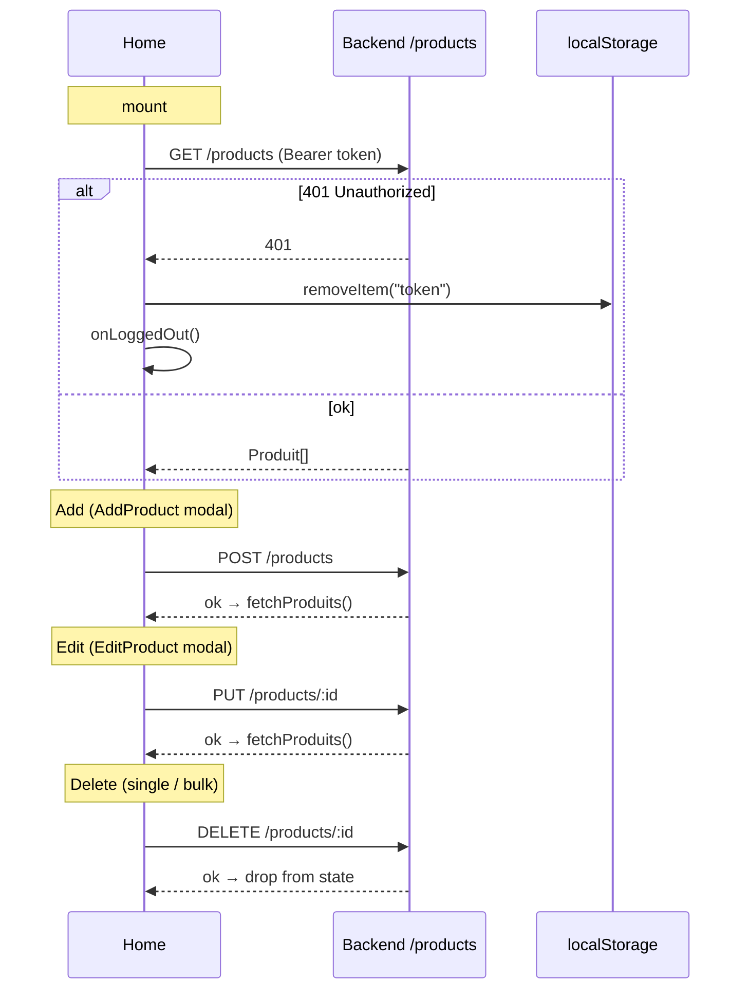
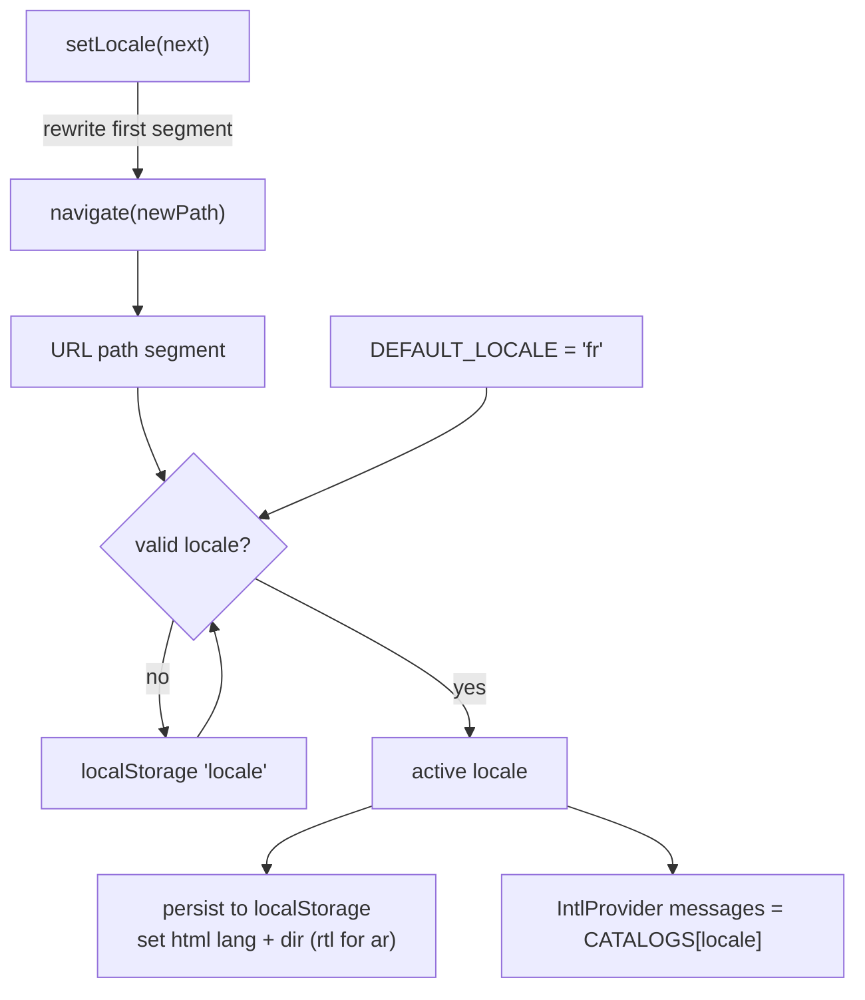
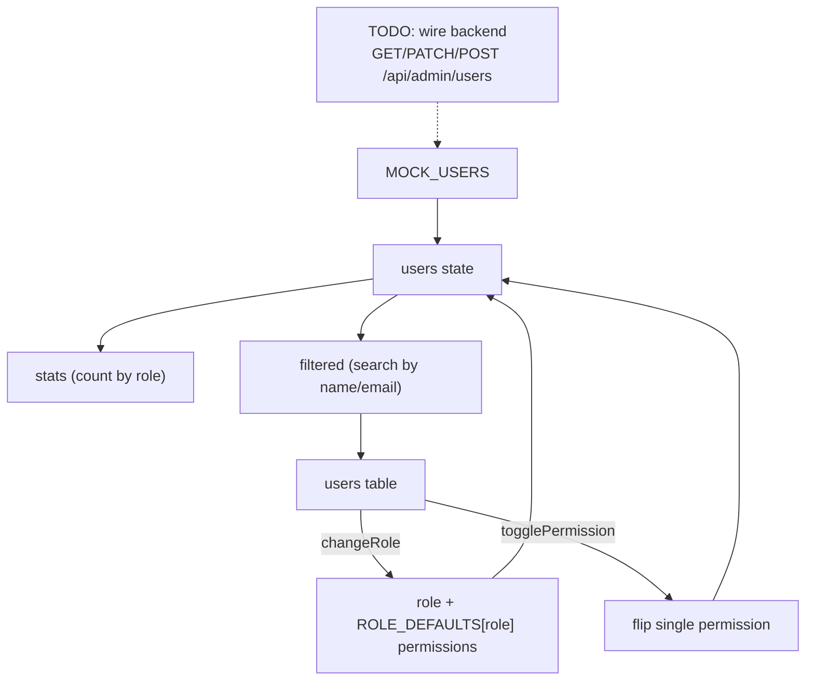

# DemoLogin — Architecture Diagrams

Mermaid diagrams describing the structure and flows of `DemoLogin/src`.

## 1. Component / Module Structure



## 2. Routing



`hasToken()` checks `localStorage.token`. The active `locale` is the first URL
segment (`/ar/register` → `ar`), falling back to stored/`fr`.

## 3. Authentication Flow



## 4. Home — Product CRUD & State



Client-side pipeline in `Home`: `produits` → **filter** (search + category)
→ **sort** (`newest`/`oldest`/`name-asc`/`name-desc`) → `displayed` →
**slice** by `visibleCount` (infinite scroll via `IntersectionObserver`,
page size 12).

## 5. i18n / Locale Resolution



## 6. SuperAdmin Dashboard (mock, local state)



Roles: `superadmin · admin · editor · viewer`. Permissions:
`canAdd · canEdit · canDelete`. Data is mocked in component state — no backend
calls yet.
```